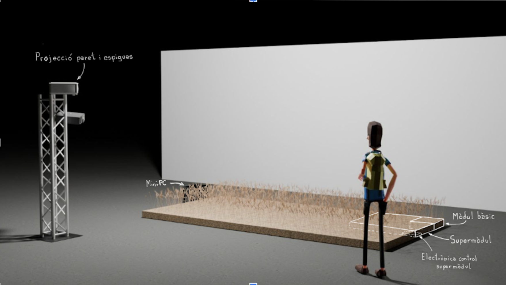

# TDF25 El ball de la civada
Repositori general del projecte del TAV (Tecnoateneu de Vilablareix) pel "Temps de flors" del 2025 de la ciutat de Girona.

## Descripció

Tenim previst fer un mòdul bàsic de 36 espigues posades en una matriu de 6x6. Aquest mòdul farà 36cm x 36 cm.

Disposant 9 mòduls bàsics en una configuració de 3x3 farem un supermòdul d’apoximadament 1m x 1m. Agrupant 8 supermòduls en una estructura de 2 x 4 obtindrem un camp de 2m x 4m. Ara bé, ens podem adaptar a la forma de l’espai, podria ser de 1m x 8 m o de 2m x 3m.

Cada mòdul de 36 espigues anirà controlada per 4 servomotors per donar el moviment en els 2 eixos. Faran falta 162 servomotors per controlar tot el muntatge. Aquest servomotors aniran controlats per plaques ESP32 que a la vegada aniran controlades per un miniPC a través de WiFi.
Tenim previst posar focos per il·luminar la instal·lació que també aniran controlades per l’ordinador central. Juntament amb un parell de projectors que posin un fons a la instal·lació.

## Estructura repositoris

[TDF25 El ball de la civada](https://github.com/tecnoateneu/TDF25-El-ball-de-la-civada) (aquest repositori): Documentació general i mecànica.

[TDF25 Control supermodul](https://github.com/tecnoateneu/TDF25-Control-supermodul): Repositori amb la documentació de la part electronica i el software que controla els supermòduls.

[TDF25 Enviament Dades](https://github.com/tecnoateneu/TDF25-Enviament-Dades): Repositori amb la documentació que envia les trames cap als supermòduls.

[TDF25 Generador sequencies](https://github.com/tecnoateneu/TDF25-Generador-sequencies): Repositori amb la decumentació per generar les seqüencies de moviment i llum.
